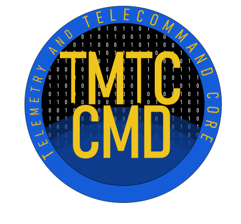

<p align="center">  </p>

TMTC Commander Core [](https://tmtccmd.readthedocs.io/en/latest/?badge=latest)
[](https://github.com/spacefisch/tmtccmd/actions/workflows/package.yml)
[](https://codecov.io/gh/robamu-org/tmtccmd)
[](https://badge.fury.io/py/tmtccmd)
====

## Overview

- Documentation: https://tmtccmd.readthedocs.io/en/latest/
- Project Homepage: https://github.com/robamu-org/tmtccmd

This commander application was first developed by KSat for the 
[SOURCE](https://www.ksat-stuttgart.de/en/our-missions/source/) project to test the on-board 
software but has evolved into a more generic tool for satellite developers to perform TMTC 
(Telemetry and Telecommand) handling and testing via different communication interfaces. 
Currently, only the PUS standard is implemented as a packet standard. This tool can be used either 
as a command line tool or as a GUI tool. The GUI features require a PyQt5 installation.

This client currently supports the following communication interfaces:

1. TCP/IP with UDP and TCP
2. Serial Communication using fixed frames or a simple ASCII based transport layer
3. QEMU, using a virtual serial interface

The TMTC commander also includes some telemetry handling components and telecommand packaging
helpers. Some of those components are tailored towards usage with the
[Flight Software Framework (FSFW)](https://egit.irs.uni-stuttgart.de/fsfw/fsfw/).

## Examples 

The `example` folder contains a simple example using a dummy communication interface.
It can be run like this on Linux

```sh
cd example
./tmtc_cli.py
```

or on Windows

```sh
cd example
py tmtc_cli.py
```

The [SOURCE](https://git.ksat-stuttgart.de/source/tmtc) implementation of the TMTC commander
provides a more complex implementation.

## Tests

All tests are provided in the `src/test` folder and can be run with coverage information
by running

```sh
coverage run -m pytest
```

provided that `pytest` and `coverage` were installed with

```sh
python3 -m pip install coverage pytest
```

## Installation

On Ubuntu, if `pip` is not installed yet, you can install it with

```sh
sudo apt-get install python3-pip
```

The minimum allowed Python version is 3.8.
For developers, it is recommended to add this repostiory as a submodule
with the following command:

```sh
git submodule add https://github.com/robamu-org/tmtccmd.git
```

For the following commands, replace `python3` with `py` on Windows.
After that, you can install the package in an editable mode with the following command:

```sh
cd tmtccmd
python3 -m pip install -e .
```

To also install the requirements for the GUI mode, run this command instead

```sh
cd tmtccmd
python3 -m pip install -e .[gui]
```

Omit the `-e` for a regular installation. Alternatively you can now install the package
from PyPI with `python3 -m pip install -e tmtccmd[gui]`.

## Using PyCharm

When using PyCharm and running the application from PyCharm, it is recommended to set
the `Emulate terminal in output console` option. This is because packages like `prompt-toolkit`
require a complete terminal for features like auto-complete to work.
