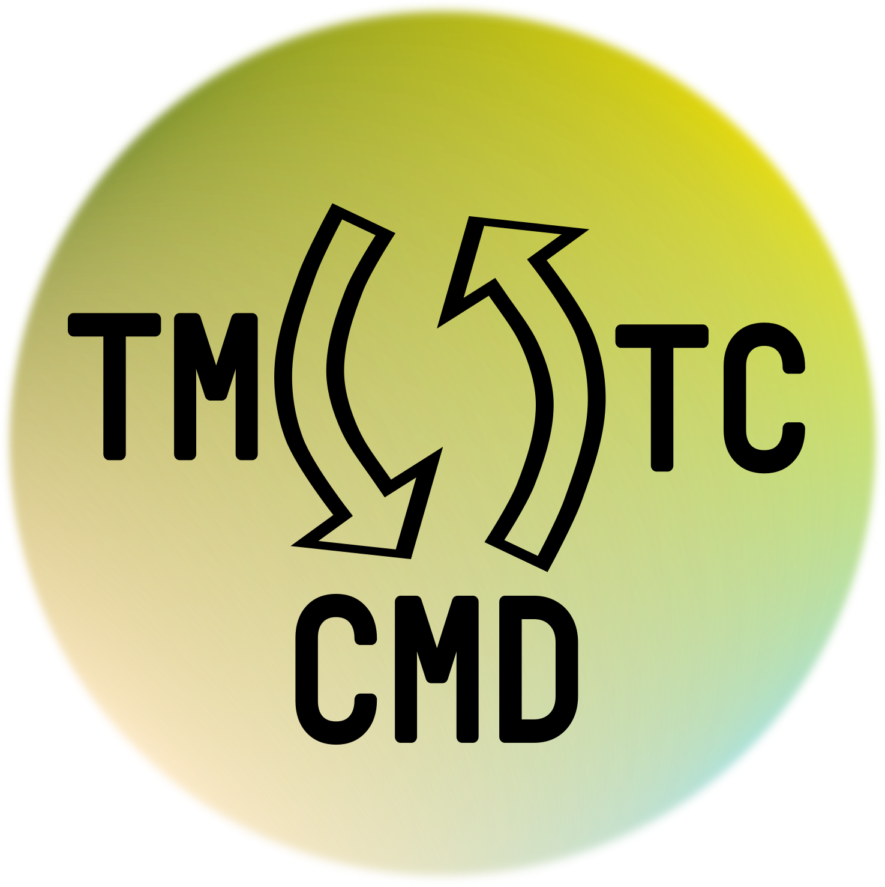

<p align="center">  </p>

TMTC Commander [](https://tmtccmd.readthedocs.io/en/latest/?badge=latest)
[](https://github.com/robamu-org/tmtccmd/actions/workflows/package.yml)
[](https://codecov.io/gh/robamu-org/tmtccmd)
[](https://badge.fury.io/py/tmtccmd)
====

## Overview

- [Documentation](https://tmtccmd.readthedocs.io/en/latest/)
- [Project Homepage](https://github.com/robamu-org/tmtccmd)

This is a small Python framework targeted towards the testing of remote systems like satellites
and rovers. It simplifies sending and receiving TMTCs (Telemetry and Telecommands)
and testing via different communication interfaces. This tool can be
used either as a command line tool or as a GUI tool. The GUI features require a PyQt5 installation.
This package also has dedicated support to send and receive ECSS PUS packets or other generic
CCSDS packets.

## Features

- Generic communication interface abstraction which can also be used without the other components
  of the library if the goal is to separate the packet logic from the communication interface.
  The dedicated documentation chapter contains a more information and examples.
- Special support for [Packet Utilisation Standard (PUS)](https://ecss.nl/standard/ecss-e-st-70-41c-space-engineering-telemetry-and-telecommand-packet-utilization-15-april-2016/)
  packets and [CCSDS Space Packets](https://public.ccsds.org/Pubs/133x0b2e1.pdf).
  This library uses the [spacepackets](https://github.com/us-irs/py-spacepackets) library for most
  packet implementations.
- High level CFDP components which allow to build
  [CFDP standard conformant](https://public.ccsds.org/Pubs/727x0b5.pdf) CFDP handlers. Currently
  only supports unacknowledged mode.
- Support for both CLI and GUI usage
- Flexibility in the way to specify telecommands to send and how to handle incoming telemetry.
  This is done by requiring the user to specify callbacks for both TC specification and TM handling.
- One-Queue Mode for simple command sequences and Multi-Queue for more complex command sequences
- Listener mode to only listen to incoming telemetry
- Basic logger components which can be used to store sent Telecommands and incoming Telemetry
  in files

- Some components are tailored towards usage with the
  [Flight Software Framework (FSFW)](https://egit.irs.uni-stuttgart.de/fsfw/fsfw/)

The framework currently supports the following communication interfaces:

1. TCP/IP with UDP and TCP. The TCP interface currently only supports sending CCSDS space packets
   and is able to parse those packets from the received data stream.
2. Serial Communication with a transport layer using either [COBS](https://pypi.org/project/cobs/)
   encoded packets or DLE as a simple [ASCII based transport layer](https://pypi.org/project/dle-encoder/).
3. QEMU, using a virtual serial interface

It is also possible to supply custom interfaces.

## Examples 

The [`examples`](https://github.com/robamu-org/tmtccmd/tree/main/examples) folder contains a simple
example using a  dummy communication interface. It sends a PUS ping telecommand and then reads the
ping reply and  the verification replies back from the dummy interface. Assuming, the package was
installed in a virtual environment like shown in the [installation chapter](#install), it can be
run like this for the CLI mode:

```sh
cd examples
./tmtcc.py
```

or like this for the GUI mode:

```sh
cd examples
./tmtcc.py -g
```

The [EIVE](https://egit.irs.uni-stuttgart.de/eive/eive-tmtc) and
[SOURCE](https://git.ksat-stuttgart.de/source/tmtc) project implementation of the TMTC commander
provide more complex implementations.

## Tests

To run the tests, install the test requirements first with the following command, assuming
a virtual environment:

```sh
pip install .[gui,test]
```

All tests are provided in the `src/test` folder and can be run with coverage information
by running

```sh
coverage run -m pytest
```

provided that `pytest` and `coverage` were installed with

```sh
pip install coverage pytest
```

## <a id="install"></a> Installation

It is recommended to use a virtual environment when installing this library. The steps here
assume you have [set up and activated the environment](https://docs.python.org/3/tutorial/venv.html).

To install the full version with GUI support, run the following command to install from the cloned
source code

```sh
pip install .[gui]
```

You can omit `[gui]` for a CLI only installation. Alternatively you can also install the package
from PyPI with `pip install -e tmtccmd[gui]`.

## Documentation

The documentation is built with Sphinx

Install the required dependencies first:

```sh
pip install -r docs/requirements.txt
```

Then the documentation can be built with

```sh
cd docs
make html
```

The doctests can be run with the following command

```sh
cd docs
make doctest
```

## Using PyCharm

When using PyCharm and running the application from PyCharm, it is recommended to set
the `Emulate terminal in output console` option. This is because packages like `prompt-toolkit`
require a complete terminal for features like auto-complete to work.
