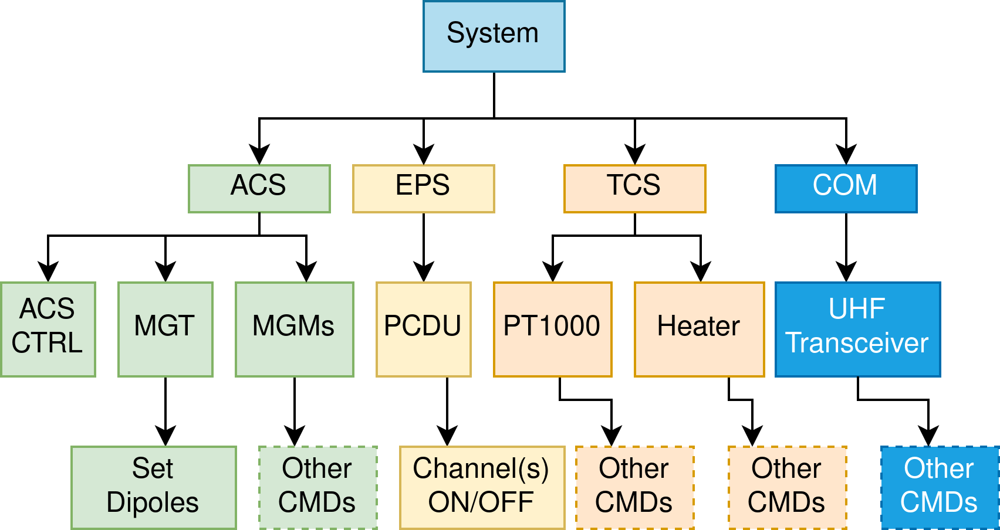

===============
Getting Started
===============

Example Project
================

The `example application <https://github.com/robamu-org/tmtccmd/tree/main/examples/app>`_ is the
best way to learn how this framework works and to get started. It shows how to set up handler
classes for TC and TM handling and then ties together all components. You can also run this
application in GUI mode by passing the ``-g`` GUI flag to the example application.

Some explanation of classes and modules inside the example are given here.

The Configuration Hook Class
==============================

The class `ExampleHookClass` is the example configuration class implementing
the :py:class:`tmtccmd.config.hook.HookBase`. There are two functions which must be impelemented
by a user:

1. The :py:meth:`tmtccmd.config.hook.HookBase.get_communication_interface` method
   is used to return a communication interface given a string identifier. You can read more
   about the communication abstraction in the :ref:`com` chapter.
2. The :py:meth:`tmtccmd.config.hook.HookBase.get_command_definitions` returns a tree of
   command definition which can be used by both users and developers to specify the available
   commands and procedures.

TC Command Definition Specification
--------------------------------------

The command tree mechanism provides a flexible mechanism to also model the command definitions
for more complex systems. These systems are oftentimes structured into dedicated modules.
For exampe, the command tree for a satellite system might look like this:

For a system like this, it makes a lot of sense to also model the command definitions similarly
to the system. An example tree modelling the system shown in the example above would look like this
when printing one built using the :py:class:`tmtccmd.config.tmtc.CmdTreeNode`:

.. code-block:: console

  /                                   [ Root Node ]
  ├── ping                            [ Send PUS ping command ]
  ├── test                            [ Test Node ]
  │  └── event                        [ Send PUS event test command ]
  ├── system                          [ System Commands ]
  ├── acs                             [ ACS Subsystem ]
  │  ├── acs_ctrl                     [ ACS Controller ]
  │  ├── mgt                          [ Magnetorquer ]
  │     └── set_dipoles               [ Set MGT Dipoles ]
  │  ├── mgm0                         [ Magnetometer 0 ]
  │     └── other cmds                [ Other MGM commands ]
  │  └── mgm1                         [ Magnetometer 1 ]
  │     └── other cmds                [ Other MGM commands ]
  ├── tcs                             [ TCS Subsystem ]
  │  ├── tcs_ctrl                     [ TCS Controller ]
  │  ├── pt1000                       [ Temperature Sensor ]
  │  └── heater                       [ Heater ]
  ├── com                             [ COM Subsystem ]
  │  └── uhf_transceiver              [ UHF Transceiver ]
  └── eps                             [ EPS Subsystem ]
     └── pcdu                         [ PCDU ]
        ├── channel_0_on              [ Channel 0 on ]
        ├── channel_0_off             [ Channel 0 off ]
        ├── channel_1_on              [ Channel 1 on ]
        └── channel_1_off             [ Channel 1 off ]

and the code to create this tree would look like this:

.. code-block:: python

    def get_command_definitions(self) -> CmdTreeNode:
        root_node = CmdTreeNode.root_node()
        root_node.add_child(CmdTreeNode("ping", "Send PUS ping command"))
        root_node.add_child(CmdTreeNode("test", "Test Node"))
        root_node.children["test"].add_child(
            CmdTreeNode("event", "Send PUS event test command")
        )
        root_node.add_child(CmdTreeNode("system", "System Commands"))
        root_node.add_child(CmdTreeNode("acs", "ACS Subsystem"))
        root_node["acs"].add_child(CmdTreeNode("acs_ctrl", "ACS Controller"))
        root_node["acs"].add_child(CmdTreeNode("mgt", "Magnetorquer"))
        root_node["acs"]["mgt"].add_child(CmdTreeNode("set_dipoles", "Set MGT Dipoles"))
        root_node["acs"].add_child(CmdTreeNode("mgm0", "Magnetometer 0"))
        root_node["acs"].add_child(CmdTreeNode("mgm1", "Magnetometer 1"))
        mgm_node = CmdTreeNode("other cmds", "Other MGM commands")
        root_node["acs"]["mgm0"].add_child(mgm_node)
        root_node["acs"]["mgm1"].add_child(mgm_node)
        root_node.add_child(CmdTreeNode("tcs", "TCS Subsystem"))
        root_node["tcs"].add_child(CmdTreeNode("tcs_ctrl", "TCS Controller"))
        root_node["tcs"].add_child(CmdTreeNode("pt1000", "Temperature Sensor"))
        root_node["tcs"].add_child(CmdTreeNode("heater", "Heater"))
        root_node.add_child(CmdTreeNode("com", "COM Subsystem"))
        root_node["com"].add_child(CmdTreeNode("uhf_transceiver", "UHF Transceiver"))
        root_node.add_child(CmdTreeNode("eps", "EPS Subsystem"))
        root_node["eps"].add_child(CmdTreeNode("pcdu", "PCDU"))
        root_node["eps"]["pcdu"].add_child(CmdTreeNode("channel_0_on", "Channel 0 on"))
        root_node["eps"]["pcdu"].add_child(
            CmdTreeNode("channel_0_off", "Channel 0 off")
        )
        root_node["eps"]["pcdu"].add_child(CmdTreeNode("channel_1_on", "Channel 1 on"))
        root_node["eps"]["pcdu"].add_child(
            CmdTreeNode("channel_1_off", "Channel 1 off")
        )
        return root_node

You can now specify your commands as command paths, which will then serve as identifier for single
command or command stacks and procedures. The command path will be passed on as the `cmd_path`
parameter of the :py:class:`tmtccmd.tmtc.procedure.DefaultProcedureInfo` which is passed to
the :py:class:`tmtccmd.tmtc.handler.TcHandlerBase` implementation of the user.

It is also possible to pass the command path as a CLI argument. For example, you can use
``./tmtcc.py -p /test`` to send a ping command with the example application. Passing the
command tree definition to the framework also allows it to provide a GUI command path selector
for the GUI mode.

It is optionally possible to pass a command history to the framework by implementing the
:py:meth:`tmtccmd.config.hook.HookBase.get_cmd_history` function. An example implementation
using the :py:class:`prompt_toolkit.history.FileHistory` class would look like this:

.. code-block:: python

    def get_cmd_history(self) -> Optional[History]:
        """Optionlly return a history class for the past command paths which will be used
        when prompting a commad path from the user in CLI mode."""
        return FileHistory(".tmtc-cli-history.txt")

The TC handler
==============================

This object is responsible for the telecommand handling. Therefore this object implements
the :py:class:`tmtccmd.tmtc.handler.TcHandlerBase`.

In the example case, the handler object is reponsible for returning telecommand queues based on
input information. This task is done by the :py:meth:`tmtccmd.tmtc.handler.TcHandlerBase.feed_cb`
callback method.

The actual handling of telecommand queue entries is done in the
:py:meth:`tmtccmd.tmtc.handler.TcHandlerBase.send_cb` method implementation. One thing to note here
is that a queue entry does not necessarily have to be a command to be sent. For example,
the queue can also contain something like log requests or delay requests, or even complete
custom requests. These requests can then be handled by the user.

The PUS TM handler
==============================

This object is responsible for the handling of PUS telemetry. In the example case, the
handler object is responsible space packets with a certain application process identifier (APID).
Therefore, this object implements the :py:class:`tmtccmd.tmtc.common.SpecificApidHandlerBase`.

The `handle_tm` method implementation is the primary functions where incoming PUS packets
are handled. This can something like prinouts or logging, either to a file or to a database.

Other example applications
===========================
The `EIVE <https://egit.irs.uni-stuttgart.de/eive/eive-tmtc>`_ and
`SOURCE <https://git.ksat-stuttgart.de/source/tmtc>`_ project implementation of the TMTC commander
provide more complex implementations.

..
    TODO: More explanations for example
