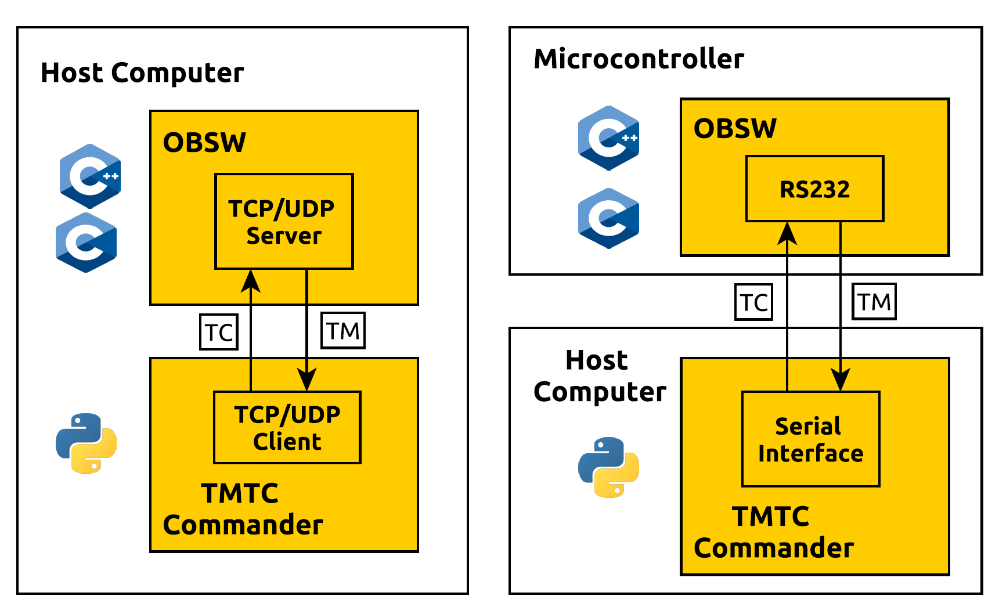

=============
 Introduction
=============

Overview
=========

The goal of this framework is to make it as easy to send telecommands (TCs)
to the On-Board Software (OBSW) running on an external On-Board Computer (OBC) and to analyse
the telemetry (TMs) coming back. The following graph shows two possible ways to use
the TMTC commander

The first way assumes that the OBSW can be run on a host computer and starts a TPC/IP
server internally. The TMTC commander can then be used to send telecommands via the TCP/IP
interface. The second way assumes that the OBSW is run on an external microcontroller.
Here, the serial interface is used to send telecommands. Other ways like sending TMTCs 
via Ethernet to a microcontroller running a TCP/IP server are possible as well.

.. _`SOURCE`: https://www.ksat-stuttgart.de/en/our-missions/source/

..
    TODO: More docs here, general information how components are used

Features
=========

- Generic communication interface abstraction in form of the :py:class:`tmtccmd.com.ComInterface`.
  This abstraction could also be used without the other components of the library if the goal is
  to separate the packet logic from the communication interface. The :ref:`com` chapter contains a
  more information and examples.
- Special support for `Packet Utilisation Standard (PUS)`_ packets and `CCSDS Space Packets`_.
  This library uses the `spacepackets`_ library for most packet implementations.
- Support for both CLI and GUI usage
- Flexibility in the way to specify telecommands to send and how to handle incoming telemetry.
  This is done by requiring the user to specify callbacks for both TC specification and TM handling.
- One-Queue Mode for simple command sequences and Multi-Queue for more complex command sequences
- Listener mode to only listen to incoming telemetry
- Basic logger components which can be used to store sent Telecommands and incoming Telemetry
  in files
- Some components are tailored towards usage with the
  `Flight Software Framework (FSFW) <https://egit.irs.uni-stuttgart.de/fsfw/fsfw/>`_.

This framework also has a communication interface abstraction which allows to exchange TMTC through
different channels. The framework currently supports the following communication interfaces:

1. TCP/IP with the :py:class:`tmtccmd.com.udp.UdpComIF` and :py:class:`tmtccmd.com.tcp.TcpSpacePacketsComIF`.
2. Serial Communication with `COBS <https://pypi.org/project/cobs/>`_ encoded packets by using the
   :py:class:`tmtccmd.com.serial_cobs.SerialCobsComIF`.
3. The `DLE ASCII based transport layer <https://pypi.org/project/dle-encoder/>`_ by using the
   :py:class:`tmtccmd.com.serial_dle.SerialDleComIF`.
4. QEMU, using a virtual serial interface.

It is also possible to supply custom interfaces.

.. _`Packet Utilisation Standard (PUS)`: https://ecss.nl/standard/ecss-e-st-70-41c-space-engineering-telemetry-and-telecommand-packet-utilization-15-april-2016/
.. _`CCSDS Space Packets`: https://public.ccsds.org/Pubs/133x0b2e1.pdf
.. _`spacepackets`: https://github.com/us-irs/py-spacepackets
